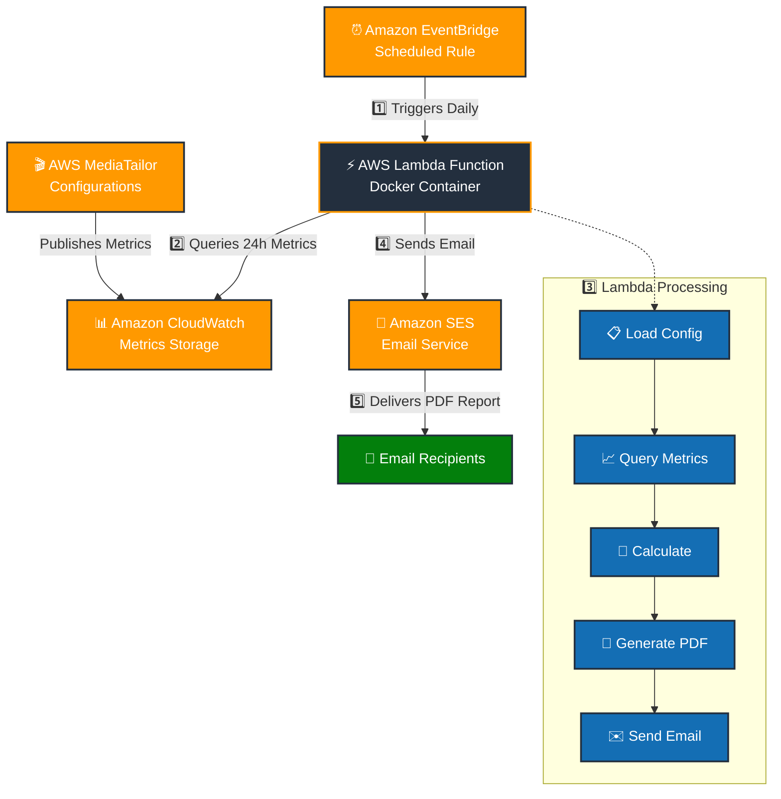

# MediaTailor Daily Report - Architecture

## Overview

The MediaTailor Daily Report is a serverless solution that automatically generates and emails daily performance reports for AWS MediaTailor configurations. The system monitors ad fill rates, duration metrics, and provides actionable insights for revenue optimization.

## Architecture Diagram

## Components

### 1. AWS MediaTailor
- **Purpose**: Source of ad serving metrics
- **Metrics Collected**:
  - `Avail.FillRate` - Average fill rate across ad avails
  - `Avail.Duration` - Total planned ad time
  - `Avail.FilledDuration` - Total filled ad time
  - `AdDecisionServer.FillRate` - ADS fill rate

### 2. Amazon CloudWatch
- **Purpose**: Metrics storage and aggregation
- **Data Points**: 24-hour aggregated metrics
- **Statistics**: Average and Sum values
- **Retention**: Standard CloudWatch retention policies

### 3. Amazon EventBridge
- **Purpose**: Scheduled trigger for daily reports
- **Schedule**: Configurable cron expression (default: 16:00 UTC)
- **Trigger**: Invokes Lambda function daily
- **Reliability**: Built-in retry and error handling

### 4. AWS Lambda Function (Docker Container)
- **Runtime**: Python 3.9+ with Docker container
- **Architecture**: ARM64 for cost optimization
- **Memory**: 512 MB
- **Timeout**: 5 minutes
- **Trigger**: EventBridge scheduled event
- **Dependencies**: ReportLab, Boto3, email libraries
- **Configuration**: Injected via environment variables from config.json

#### Lambda Function Flow:
1. **Configuration Loading**: Parse REPORT_CONFIG environment variable
2. **Metrics Retrieval**: Query CloudWatch for each MediaTailor config (24h window)
3. **Data Processing**: Calculate weighted fill rates and status indicators
4. **PDF Generation**: Create formatted report with color-coded status
5. **Email Composition**: Build multipart MIME message with PDF attachment
6. **Email Delivery**: Send via SES Raw Email API

### 5. Amazon SES (Simple Email Service)
- **Purpose**: Email delivery service
- **Email Identity**: CDK-managed verified sender email
- **API**: Raw Email API for PDF attachments
- **Features**: 
  - PDF attachment support
  - Multiple recipients
  - Delivery tracking
  - Bounce/complaint handling
- **Requirements**: Verified sender email address (automated via CDK)

## Data Flow

1️⃣ **EventBridge** triggers Lambda function daily (16:00 UTC)
2️⃣ **Lambda** queries CloudWatch for 24-hour MediaTailor metrics
3️⃣ **Lambda** processes data and generates PDF report
4️⃣ **Lambda** sends email via SES
5️⃣ **Recipients** receive PDF report

## Security

### IAM Permissions
- **CloudWatch**: `GetMetricStatistics`, `ListMetrics` (all resources)
- **SES**: `SendEmail`, `SendRawEmail` (scoped to email identity ARN)
- **Logs**: CloudWatch Logs for monitoring (automatic)
- **Principle of Least Privilege**: Permissions scoped to specific resources

### Network Security
- Lambda runs in AWS managed VPC
- All communications over HTTPS/TLS
- No inbound network access required

### Data Protection
- Metrics data encrypted in transit and at rest
- Email content encrypted during transmission
- No sensitive data stored in Lambda

## Scalability

### Current Limits
- **Lambda**: 5-minute timeout, 512 MB memory
- **SES**: 200 emails/day (sandbox), higher with production access
- **CloudWatch**: Standard API rate limits

### Scaling Considerations
- Multiple MediaTailor configurations supported
- Configurable recipient lists
- Regional deployment flexibility
- Cost scales with usage (serverless)

## Monitoring & Observability

### CloudWatch Logs
- Lambda execution logs
- Error tracking and debugging
- Performance metrics

### CloudWatch Metrics
- Lambda duration and memory usage
- Error rates and success rates
- SES delivery statistics

### Alerting
- Lambda function failures
- SES delivery failures
- CloudWatch API throttling

## Cost Optimization

### Serverless Benefits
- Pay-per-execution model
- No idle resource costs
- Automatic scaling

### Cost Components
- **Lambda**: Execution time and memory
- **SES**: Email sending costs
- **CloudWatch**: Metrics storage and API calls
- **EventBridge**: Rule evaluations

## Deployment

### Infrastructure as Code
- **CDK (Cloud Development Kit)**: Python implementation
- **CloudFormation**: Generated templates
- **Docker**: Container-based Lambda deployment
- **Configuration**: External config.json file
- **Version Control**: Git-based deployment

### Environments
- Single-region deployment
- Configurable via `config.json`
- Environment-specific configurations

## Disaster Recovery

### Backup Strategy
- Configuration stored in version control
- Lambda code in container registry
- CloudWatch metrics retained per AWS policy

### Recovery Procedures
- Redeploy from source code
- Reconfigure SES email verification
- Restore from CloudFormation template

## Future Enhancements

### Potential Improvements
- **Dashboard Integration**: Real-time web dashboard
- **Alert Thresholds**: Configurable alerting rules
- **Historical Trends**: Multi-day trend analysis
- **Custom Metrics**: Additional calculated metrics
- **Multi-Region**: Cross-region metric aggregation